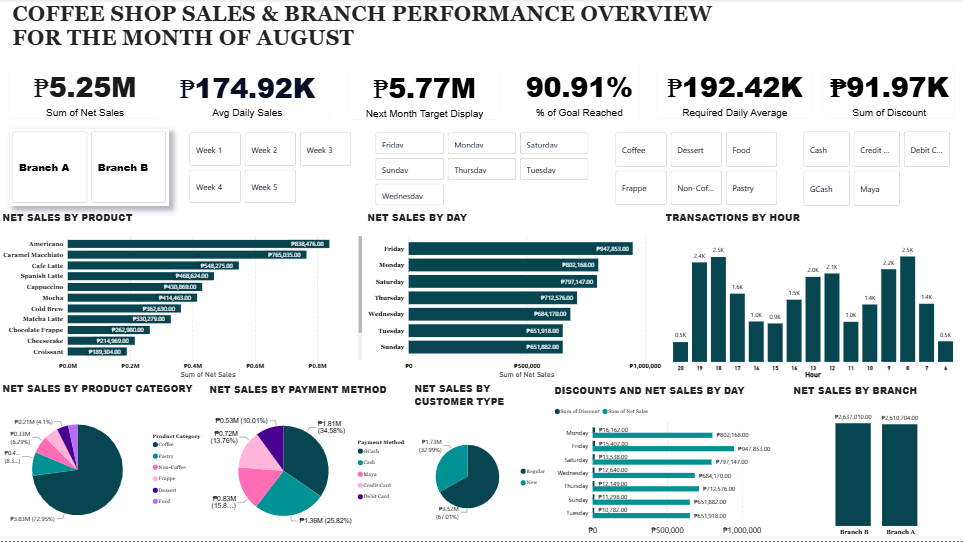

# ☕ Coffee Shop Sales & Branch Performance Dashboard

## Overview
Interactive Power BI dashboard analyzing sales performance, transaction patterns, and branch comparison for a coffee shop business — covering the month of August.

## 📊 Dashboard Preview

## Key Metrics (August)
- **Sum of Net Sales:** ₱5.25M
- **Avg Daily Sales:** ₱174.92K
- **Next Month Target:** ₱5.77M
- **% of Goal Reached:** 90.91%
- **Sum of Discount:** ₱91.97K
- **Required Daily Average:** ₱192.42K

## Key Features
- Sales tracking by product, day, hour, and branch
- Payment method and customer type breakdown
- Discount and monthly target tracking
- Interactive slicers for branch, week, day, and category filtering

## Key Insights
- Peak sales hours are around 6–7 PM, indicating evening rush
- Friday posted the highest net sales (₱947.85K); Tuesday and Sunday showed the lowest — opportunity for targeted promos
- Americano and Caramel Macchiato are the top-performing products
- GCash is the leading payment method (34.58% of net sales)
- Regular customers (52.99%) slightly outpace new customers (47.01%)
- Branch A (₱2.61M) and Branch B (₱2.64M) are nearly even in performance
- A ₱520K gap remains to reach next month's target

## Tools Used
- Power BI Desktop
- Microsoft Excel (data cleaning & preparation)
- DAX (Data Analysis Expressions)
- Power Query

## Data Source
Sample/fictional data created for portfolio demonstration purposes.
